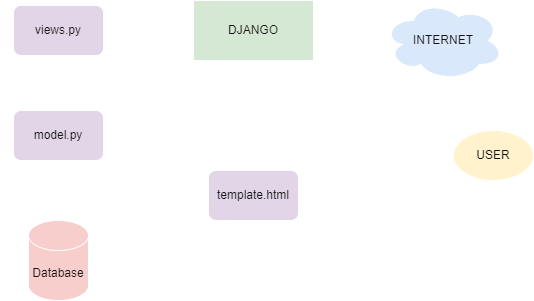

# Katalog
https://pbp-asg2.herokuapp.com/katalog/

# MVT (Models, Views, and Template)
## Diagram


## Why Virutal Environment is Necessary
By using a virtual environment, multiple versions of Python, packages, library and modules can coexist peacefully on our machine. This will come in handy, when for example, the current project we are working on requires django version 1.1, while another project requires django ver 2.2. Under normal circumstances, it would be impossible for our computer to run two versions of django simultaneously, hence why virtual environment is necessary.

## Implementation
### 1. Create a function on `views.py`
```py
from katalog.models import CatalogItem


def show_katalog(request):
    data_katalog_item = CatalogItem.objects.all()
    context = {
        'list_item': data_katalog_item,
        'name': 'Jovian',
        'student_id': '2106720891'
    }

    return render(request, "katalog.html", context)
```
This function imports the model `CatalogItem`, which will be parsed in `context` as `list_item` with other datas: `name` and `student_id`. The function the calls the render function, which will then return the template (in this case `katalog.html`).
